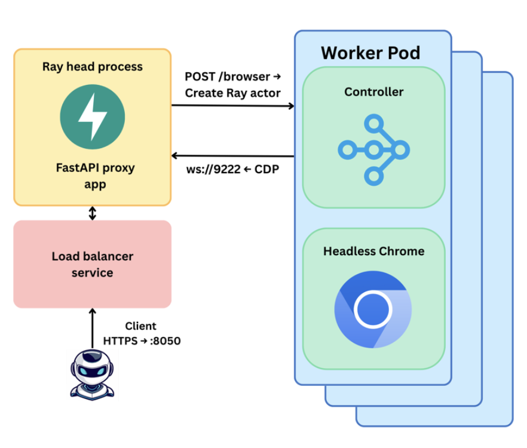

<div align="center">
  
  <h1>Browserstation</h1>
  <p>Open-source, infra-agnostic browser agent framework. Debug locally. Scale to production.</p>
  <p>
    <a href="https://github.com/operolabs/browserstation/stargazers">
      
    </a>
    <a href="https://x.com/operolabs" alt="Twitter Follow">
        </a>
    <a href="https://github.com/operolabs/browserstation/blob/main/LICENSE">
      
    </a>
  </p>
</div>

**Browserstation** is an open-source alternative to Browserbase. Give your agents and scrapers full browser capabilities, with the ability to debug locally and scale to production without being locked into proprietary infrastructure.

- **Infra Agnostic**: Deploy anywhere (AWS, GCP, Azure, on-prem, or local Docker/Kubernetes).
- **Cost Efficient**: Up to 85% lower cost on EKS at scale vs. managed solutions like Browserbase.
- **Hackable** – A barebones core that’s easy to customize.


## Table of Contents

- [Features](#features)
- [Quick Start](#quick-start)
- [API Endpoints](#api-endpoints)
- [Architecture](#architecture)
- [Production Deployments](#production-deployments)
- [Roadmap](#roadmap)
- [Contributing](#contributing)
- [License](#license)

## Features

| Feature                   | Description                                                         |
|---------------------------|---------------------------------------------------------------------|
| **Infra Agnostic**        | Deploy on your own Kubernetes cluster or local dev environment.     |
| **Full CDP Access**       | Direct Chrome DevTools Protocol WebSocket for maximum control.      |
| **API Security**          | API key support (first layer).                                      |
| **Monitoring**            | Built-in metrics for all running browsers and live CPU usage.       |
| **Automation Ready**      | Integrates with Browser-use, Langchain, CrewAI, and more.           |
| **No Vendor Lock-in**     | You own your infrastructure and data.                               |

## Quick Start

### 1. Prerequisites

- [kubectl](https://kubernetes.io/docs/tasks/tools/) >= 1.23
- [Helm](https://helm.sh/docs/intro/install/) >= 3.4
- [Kind](https://kind.sigs.k8s.io/) for local clusters
- [Docker](https://docs.docker.com/get-docker/)

### 2. Deploy

> Note: You must set an API key for authentication and security.

```bash
chmod +x scripts/quickstart.sh
./scripts/quickstart.sh --arm --api-key="your-secret-key"

```

_For Linux: use `./scripts/quickstart.sh --x86` instead._

### 3. Test

Set your API key and run the test:

```bash
export BROWSERSTATION_API_KEY="your-secret-key"
uv run tests/test_websocket.py

```

Monitor the cluster:

```bash
kubectl get pods -n ray-system
curl http://localhost:8050

```

Clean up the deployment:

```bash
./scripts/teardown.sh

```

### 4. Integrate

See [examples](https://github.com/operolabs/browserstation/tree/main/examples) to connect Browserstation to **Browser-use**, **Langchain**, or **CrewAI**.

## API Endpoints

| Endpoint                          | Description                                      |
|------------------------------------|--------------------------------------------------|
| `GET /`                           | Health check                                     |
| `POST /browsers`                  | Launch a new sandboxed Chrome instance           |
| `GET /browsers`                   | List all running browsers & CPU usage            |
| `GET /browsers/{id}`              | Get info and WebSocket URL for a browser         |
| `DELETE /browsers/{id}`           | Shut down a browser instance                     |
| `WS /ws/browsers/{id}/{path}`     | Chrome DevTools Protocol WebSocket stream        |

CDP access allows robust control for automation, proxy support, and live screen inspection.

## Architecture

### Sidecar Pattern & WebSocket Proxy Design

This architecture is designed to be simple and hackable (configurable) relying on **RayKube** to orchestrate Kubernetes with a head node and multiple worker nodes. 



1) **Sidecar pattern**
Each worker runs two containers: a Ray Worker Container (main) that hosts the BrowserActor responsible for managing browser lifecycle, handling API requests, allocating resources, and communicating with Chrome via localhost:9222; and a Chrome Container (sidecar) that runs headless Chrome with remote debugging enabled, providing an isolated browser instance per pod and exposing the Chrome DevTools Protocol on port 9222.

2) **Unified CDP webscoket thorugh a proxy**
In the WebSocket proxy flow, a client connects to the endpoint /ws/browsers/{id}/devtools/browser on the head node. FastAPI then validates the provided browser ID and ensures that the corresponding Chrome instance is ready. Once validated, it establishes a bidirectional WebSocket proxy to the Chrome container running in the associated worker pod. This proxy enables full access to the Chrome DevTools Protocol, allowing automation tools to control and inspect the browser seamlessly.

## Production Deployments

A full production deployment guide is available [here](./terraform/aws/README.md). Support for Azure AKS and GCP GKE is coming soon.

## Roadmap

- [ ] Browser persistence and session state
- [ ] Frontend dashboard for session analytics
- [ ] Azure AKS and GCP GKE support
- [ ] [Zendriver stealth integration](https://github.com/stephanlensky/zendriver)
- [ ] File download/upload management
- [ ] Resource management & optimization

## Contributing

- Fork the repository and create a new branch for your changes.
- Make your edits (please follow the existing code style and add/update tests if needed).
- Commit and push your branch.
- Open a pull request with a clear description of your changes.

Before starting major work, please [check open issues](https://github.com/operolabs/browserstation/issues), or [open a new issue](https://github.com/operolabs/browserstation/issues/new) to discuss ideas or bugs.

Thank you for helping improve Browserstation!

## License
[MIT](./LICENSE)

<br>
<div align="center">
  <sub>
    Made with ❤️ by <a href="https://www.operolabs.com/">Opero Labs</a>
  </sub>
</div>
